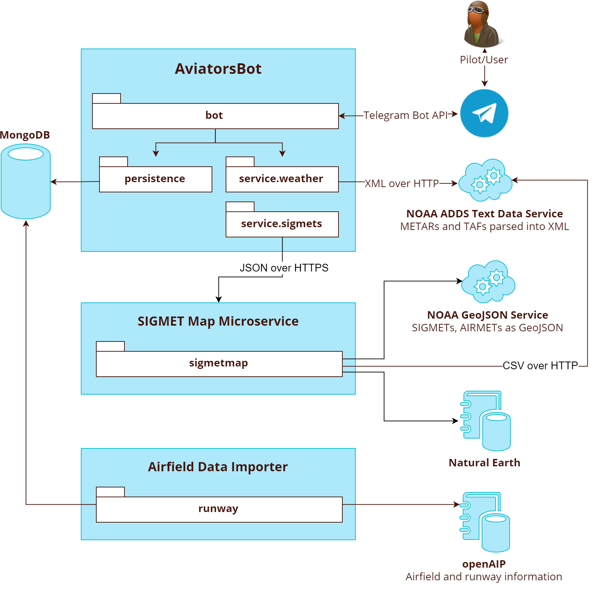
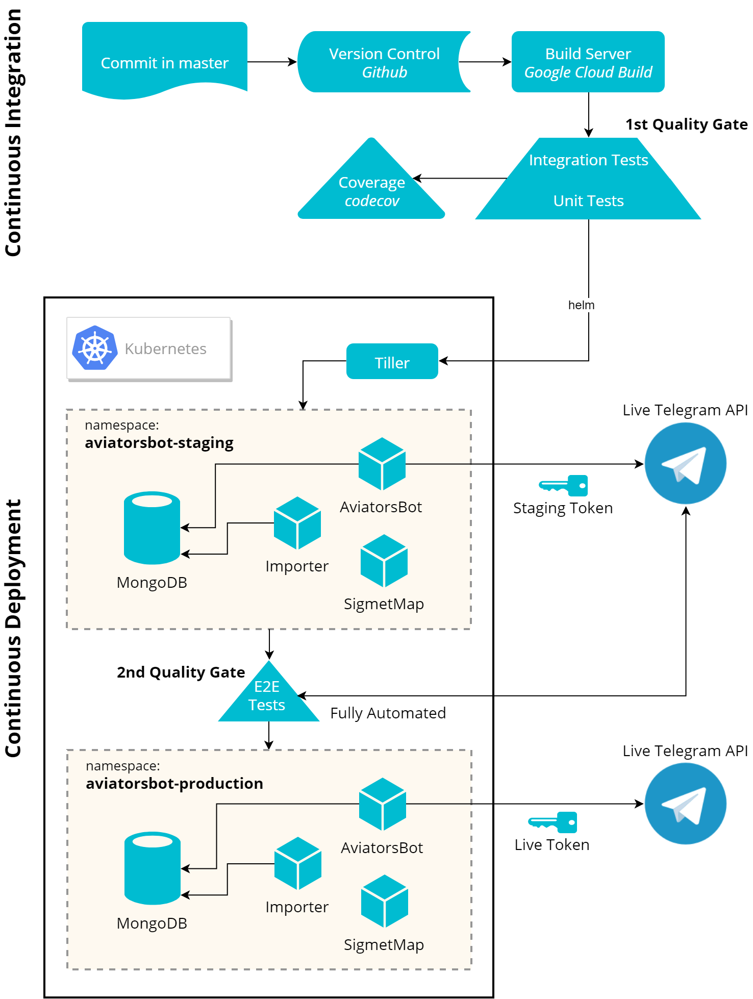

  

This Telegram bot provides a METAR and TAF aviation weather 
subscription service and weather based tools for flight planing, 
supplementing official briefing sources.

___ 
THE SOFTWARE IS PROVIDED "AS IS", WITHOUT WARRANTY OF ANY KIND, EXPRESS OR IMPLIED, INCLUDING BUT NOT LIMITED TO THE WARRANTIES OF MERCHANTABILITY, FITNESS FOR A PARTICULAR PURPOSE AND NONINFRINGEMENT. IN NO EVENT SHALL THE AUTHORS BE LIABLE FOR ANY CLAIM, DAMAGES OR OTHER LIABILITY, WHETHER IN AN ACTION OF CONTRACT, TORT OR OTHERWISE, ARISING FROM, OUT OF OR IN CONNECTION WITH THE SOFTWARE OR THE USE OR OTHER DEALINGS IN THE SOFTWARE.

THIS SOFTWARE IS NOT AN OFFICIAL BRIEFING SOURCE. ANY DATA SENT MIGHT BE WRONG, OUT OF DATE OR OTHERWISE UNUSABLE OR MISLEADING, NO GUARANTEES CAN BE MADE ABOUT THE AVAILABILITY OF THIS SERVICE, ESPECIALLY THE POLLING/SUBSCRIPTION MECHANISM
USE PURELY AT YOUR OWN RISK!
___

# Using the Bot
AviatorsBot is available on Telegram under the name: 
[`@AviatorsBot`](https://t.me/AviatorsBot)

Sending `/help` provides a list of all available commands and `/help <command>` 
will show you how to use the command. 

# Features
## METAR and TAF Subscriptions
Using this bots subscription service you will receive an update
once a new METAR or TAF is published until your subscription expires. 

Managing these subscriptions is very straight forward, user friendly
and analogous to a unix command line tool. Using `/add <ICAO>` you 
can subscribe to one or more stations. `/ls` lists the stations you
are subscribed to and `/rm` will let you unsubscribe from a station. 

## Crosswind Calculation
Sending the command `/xwind <ICAO>` to the bot will provide you with
the crosswind and headwind for all runways of that airport. 

## Density Altitude Calculation
Using the `/da <ICAO>` command the current density altitude is calculated.

This calculation is based upon the altimeter setting, elevation, temperature 
and dew point. All of these data points are taken from the METAR and require
no further user input. 

Calculating the density altitude with consideration for the actual pressure 
and water vapor pressure results in a more accurate result than just using 
the elevation and temperature. 

If the stations METAR doesn't contain an altimeter setting the METARs for the
airfields within 50km of the station will also be retrieved and the altimeter
setting of the closest field with a valid value is used. 

## Current Weather
The `/wx <ICAO>` command returns the current METAR and TAF and 
enhances the METAR with an icon for the flight category provided by 
the aviationweather.gov API. 

## Worldwide
If possible all commands provide information for the whole world. 
Using the `/region` command you can set your default region so that 
you don't have to provide your region with each command. 

## Lightning strikes
Maps of lightning strikes can be viewed using the `/strikes` command. 

## SIGMET and Flight Conditions Map
Using `/sigmet` a map of the current SIGMETs and flight conditions, as 
published in the METARs can be requested. This map is drawn by a
[`dedicated micro service.`](https://github.com/fvalka/sigmet-map)

After the map is received the user can request the SIGMETs drawn on the map
by sending `/sigmet <number_on_map>`.

## Command Shortcuts
For easier typing on mobile phones you can also omit the '/' prefix.
For Example both `/help` and just sending `help` work. 

# Technical
## System Architecture Overview
MongoDB is used as the persistence backend. Weather updates are 
retrieved from the [`aviationweather.gov/NOAA ADDS Textserver`](
https://www.aviationweather.gov/dataserver) in XML format. 
Crosswind calculations are based upon the airfield and runway information 
in the [`openAIP`](https://www.openaip.net/) database. 

## Technology Stack
AviatorsBot is written in Scala using akka for non-blocking IO. 

MongoDB is used as the backend. Accessed using the 
[`reactive-mongo`](http://reactivemongo.org/) Scala library for extending 
the non-block and reactive concept also to this part. 

## Continuous Deployment 

Using Google cloud services the bot is continuously deployed to a Google
Kubernetes engine cluster. 

Code is stored on Github, built on Google cloud build. During the build unit and
integration tests are run. If all tests pass this code is deployed to the 
`aviatorsbot-staging` namespace of the Kubernetes cluster using helm to control
the clusters Tiller instance. 

Once deployed to the staging area the end to end testing Docker image 
`AviatorsBot-E2E-Testing` is pulled and all the tests are run. This will take up to
30 minutes, since the subscription update mechanism is also tested completely and this
can only be triggered by an actual METAR update. 

When all end to end tests pass the bot is deployed to the `aviatorsbot-production` 
environment. 

## Production Ready, High Code Quality
The codebase has highly relevant unit and integration tests and a 
high coverage written mostly using ScalaTests FunSuite which doubles
as a specification of the bots feature set and error handling strategies.

To enable seamless testing a macro based DI library is used for 
Inversion of Control. 

## Locking of Subscription Update Poller
A simple locking algorithm is implemented which uses MongoDB as its backend and 
is designed for maximum availability instead of consistency and safety. An AP distributed 
system according to the CAP theorem.  

In a prolonged network partition situation multiple instance of the bot can obtain a 
lock, leading multiple bots to send updates. This design choice was made since this 
failure mode leads to users receiving the same weather update multiple times as opposed 
to a safe concurrent lock which would to no updates being sent. 

This algorithm can survive the loss of 2 out of 3 nodes. Meaning that if only 1 node still
runs the bot will still send updates to the already existing subscribers. New subscriptions
can not be added in that situation. 

Implementing this custom algorithm was chosen because adding further systems for concurrency
control would add complexity and failure points and most readily available algorithms and
implementations prioritize safety & consistency over availability. 

### Definition of the High Availability Low Consistency Locking Algorithm 

### Locking and MongoDBs Casual Consistency
The algorithms implementation uses the MongoDB WriteConcern with the settings: `w="majority"` 
and journaling with `j = 1`. This ensures that the insert and update operations will only
succeed once they have been propagated to the majority of voting members in the cluster and
written to disk on those members. 

## Cluster Operating States and Failure Scenarios
### Normal Operating State

The machine which obtained the lock initially continues to renew it and continues to send
the weather updates to all subscribers. 

## Scheduling of Subscription Updates 
[`Quartz scheduler`](http://www.quartz-scheduler.org) is used to provide reliable 
and fault tolerant scheduling of weather updates. 

For the purpose of immediate retries a RetriableException has been implemented which 
will cause an immediate refiring of the scheduler up to the number of maximum retries. 

## Logging and Metrics
Extensive logging and configurability add to the production readiness 
of the bot. 

All commands, messages received and sent and many errors are also monitored
and timed using 
[`dropwizard metrics for scala`](https://github.com/erikvanoosten/metrics-scala). 

## METAR and TAF Change Detection 
METARs and TAFs are considered changed if the MurmurHash3 of the raw text 
changes or for METARs the observation time and for TAFs the issue time. 

This means that the user will get an update if either the issuance time
changes or the content. 

MurmurHash3 is used because a cryptographic hash function is not necessary
for this application. It generates only a 32bit hash which requires for less
storage space is fast and available in the scala standard libraries. 
